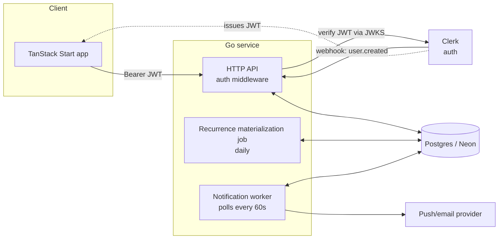

# API Design — Go Backend

Written in the requirements → entities → API → high-level design → deep
dives shape (Hello Interview style), for the Go service backing the time
management app.

## 1. Requirements Recap

Full requirements: `../docs/requirements.md`. The subset that drives API
shape:

**Functional**
- CRUD on Groups and Activity Types (with archive, not hard delete, for
  Activity Types).
- Create/edit/delete one-off and recurring Planned Entries, with per-scope
  edits ("this occurrence" / "this and following" / "all").
- Start/stop real-time recording; multiple concurrent running timers
  allowed; retroactive manual entries.
- Link a Time Log to the Planned Entry it fulfills (auto-suggested,
  manually adjustable).
- Day/week/month summaries: planned vs. actual, by Group and Activity
  Type, with "missed" and "unplanned" lists.
- Reminder notification before a planned entry starts.

**Non-functional**
- NFR-1: start/stop must feel instant (<200ms).
- NFR-2: web app, phone + desktop.
- NFR-3: no data loss on a running timer if the client restarts (state
  lives server-side from the moment Start is tapped).
- NFR-4: month-range summary queries <1s.

## 2. Core Entities

(Full schema in [data-model.md](./data-model.md).)

`User`, `Group`, `ActivityType`, `PlannedSeries`, `PlannedOccurrence`,
`TimeLog`.

## 3. API Design

All endpoints are under `/api/v1`, require `Authorization: Bearer <Clerk
JWT>`, and are implicitly scoped to the authenticated user (no `userId` in
request bodies/paths).

### 3.1 Groups
| Method & Path | Request | Response | Notes |
|---|---|---|---|
| `POST /groups` | `{name, color?, icon?}` | `201 Group` | |
| `GET /groups` | — | `200 Group[]` | |
| `PATCH /groups/{id}` | `{name?, color?, icon?}` | `200 Group` | |
| `DELETE /groups/{id}` | — | `204` / `409 Conflict` | 409 if Activity Types still reference it (FR-1.3) |

### 3.2 Activity Types
| Method & Path | Request | Response | Notes |
|---|---|---|---|
| `POST /activity-types` | `{name, groupId, description?, defaultDurationMinutes?, color?}` | `201 ActivityType` | |
| `GET /activity-types?groupId=&includeArchived=` | — | `200 ActivityType[]` | |
| `PATCH /activity-types/{id}` | partial fields | `200 ActivityType` | |
| `POST /activity-types/{id}/archive` | — | `200 ActivityType` | soft delete (FR-2.3) |

### 3.3 Planning
| Method & Path | Request | Response | Notes |
|---|---|---|---|
| `POST /planned-series` | `{activityTypeId, startDate, startTime, durationMinutes, recurrence?, notificationLeadMinutes?}` | `201 {series, occurrenceCount}` | `recurrence` omitted ⇒ one-off |
| `GET /planned-occurrences?from=&to=&groupId=` | — | `200 PlannedOccurrence[]` | main calendar read; range-bounded, always hits materialized rows |
| `PATCH /planned-occurrences/{id}?scope=this\|following\|all` | changed fields | `200 PlannedOccurrence` (+ new series id if `following`) | default `scope=this` (per decision) |
| `DELETE /planned-occurrences/{id}?scope=this\|following\|all` | — | `204` | |

### 3.4 Recording
| Method & Path | Request | Response | Notes |
|---|---|---|---|
| `POST /time-logs/start` | `{activityTypeId, plannedOccurrenceId?}` | `201 TimeLog` (`endAt: null`) | |
| `POST /time-logs/{id}/stop` | — | `200 TimeLog` | |
| `POST /time-logs` | `{activityTypeId, startAt, endAt, note?, plannedOccurrenceId?}` | `201 TimeLog` | retroactive entry (FR-4.5) |
| `PATCH /time-logs/{id}` | partial fields | `200 TimeLog` | |
| `DELETE /time-logs/{id}` | — | `204` | |
| `GET /time-logs/running` | — | `200 TimeLog[]` | all currently-running timers (FR-4.4) |
| `GET /time-logs?from=&to=&groupId=&activityTypeId=` | — | `200 TimeLog[]` | history/search |

### 3.5 Summary
| Method & Path | Request | Response | Notes |
|---|---|---|---|
| `GET /summary?period=day\|week\|month&date=&groupId=` | — | `200 {byGroup: [...], byActivityType: [...], missed: [...], unplanned: [...]}` | see [data-flows.md §3](./data-flows.md#3-planned-vs-actual-summary-weekmonth-view) |

### 3.6 User settings
| Method & Path | Request | Response | Notes |
|---|---|---|---|
| `GET /users/me` | — | `200 {timezone, notificationLeadMinutes}` | |
| `PATCH /users/me` | `{timezone?, notificationLeadMinutes?}` | `200` | |

### 3.7 Internal (not user-facing)
| Method & Path | Notes |
|---|---|
| `POST /webhooks/clerk` | Verified via Clerk signing secret; upserts `users` row. |

## 4. High-Level Design

- **Single Go service** for v1 (API handlers + two background goroutines
  for materialization and notifications) — no separate microservices;
  revisit only if one workload needs independent scaling.
- **TanStack Start** talks only to the Go API; Clerk's React SDK handles
  the login UI and hands the app a session JWT.
- **Neon Postgres** is the only datastore — no cache/queue in v1 (see
  Deep Dives for where that could change).

## 5. Request Flow Example — `POST /time-logs/start`

1. Auth middleware verifies the Clerk JWT, resolves `user_id`.
2. Handler validates `activityTypeId` belongs to that user and isn't
   archived.
3. `INSERT INTO time_logs (user_id, activity_type_id, start_at, planned_occurrence_id) VALUES (...)`.
4. Return the created row. No lookup against other running logs (overlap
   is allowed, FR-4.4) — this keeps the hot path a single-row insert,
   satisfying NFR-1.

## 6. Deep Dives

### 6.1 Recurrence materialization at scale

**Problem:** if occurrences were generated lazily by interpreting the
recurrence rule on every calendar read, weekly/monthly views would need
rule evaluation in the request path, and "this occurrence only" edits
would have nowhere to live (nothing to attach the override to).

**Approach:** materialize concrete rows in `planned_occurrences` up front,
per `data-model.md §3`:
- On series create/edit: generate a rolling window (default 60 days, or up
  to the rule's own end condition if sooner).
- A daily job extends every active series' window forward by a day, so it
  never runs dry. Cost is proportional to (active series) × (occurrences
  per day), which stays small for a single-user app — this would need
  batching/partitioning only at a scale this app doesn't target.
- Reads (`GET /planned-occurrences`) are then a plain indexed range scan
  on `(user_id, start_at)` — no rule logic at read time.

**Trade-off accepted:** storage grows with time (one row per occurrence)
instead of O(1) rule storage. At single-user scale (a few thousand
occurrences a year) this is irrelevant; it would matter for a
multi-tenant SaaS with millions of users, which is out of scope here.

### 6.2 Summary query performance

**Problem:** NFR-4 requires month-range summaries in <1s, and the
planned-vs-actual comparison spans two different tables with different
shapes (`planned_occurrences` has a fixed date, `time_logs` has a
timestamp range).

**Approach:**
- Two independent, indexed aggregate queries (see
  [data-flows.md §3](./data-flows.md#3-planned-vs-actual-summary-weekmonth-view)) —
  each is a simple `GROUP BY` over a range predicate covered by an existing
  index (`(user_id, start_at)` / `(user_id, occurrence_date)`), rather than
  one large join that would force a bigger scan.
- Merge planned + actual by `(group_id, activity_type_id)` in Go — cheap
  in-memory work once both aggregates are small (bounded by number of
  Activity Types, not number of logs).
- "Missed" / "unplanned" lists use `LEFT JOIN ... IS NULL` scoped to the
  same date range, not a full-table anti-join.
- At single-user scale this is comfortably <1s without caching; if it ever
  weren't, the next lever is a materialized daily rollup table rather than
  scanning raw rows per request.

### 6.3 Overlapping / concurrently-running timers

**Problem:** FR-4.4 allows multiple simultaneously running Time Logs —
no "only one active timer" invariant to enforce, which simplifies writes
but changes how "what's running right now" is read.

**Approach:** a partial index `time_logs (user_id) WHERE end_at IS NULL`
makes `GET /time-logs/running` a fast targeted lookup regardless of total
history size, instead of scanning all logs and filtering. No exclusion
constraint is added — overlap is a valid state, not an error case.

### 6.4 Notification delivery reliability

**Problem:** the worker must not miss a reminder, and should avoid
double-sending on retry/restart.

**Approach:**
- Poll `planned_occurrences` where the lead-time threshold has passed and
  `notification_sent_at IS NULL` (see
  [data-flows.md §4](./data-flows.md#4-reminder-notification-before-a-planned-entry)).
- Stamping `notification_sent_at` right after a successful send makes the
  common case idempotent across restarts/ticks.
- **Accepted gap:** a crash between "provider accepted the send" and "we
  stamped the row" can cause a duplicate on the next tick. For a personal
  reminder app this is a fine trade-off (worse: a missed reminder); if it
  ever mattered, the fix is an outbox pattern (write "sending" state before
  calling the provider, reconcile on restart) rather than changing the
  polling model.

### 6.5 Timezone / DST handling

**Problem:** NFR requires correct day/week/month boundaries across DST
transitions, and recurrence rules are defined in local wall-clock time
(FR-3.4's "every Monday at 07:00" must stay 07:00 local, not a fixed UTC
offset).

**Approach:** `planned_series` stores `start_time` as a local `time` plus
the rule; materialization converts to `start_at`/`end_at` (`timestamptz`)
using `users.timezone` **at generation time**. If a user changes their
timezone, only future (not-yet-materialized or regenerated) occurrences
pick up the new zone — past `planned_occurrences` rows keep their already
-resolved `timestamptz` values, so history doesn't retroactively shift.

### 6.6 Auth & authorization

**Problem:** every table is single-user-scoped; an authorization bug (an
endpoint that reads another user's row) is the highest-severity class of
bug this API can have.

**Approach:**
- Every query includes `WHERE user_id = $current_user_id` — resolved once
  per request from the verified JWT, never taken from the request body/path.
- No resource is fetched by ID alone without that filter; a 404 (not a
  403) is returned for another user's resource ID, to avoid confirming
  existence.
- Clerk owns credential storage, MFA, session revocation — the Go service
  only verifies JWTs against Clerk's JWKS and never touches passwords.
