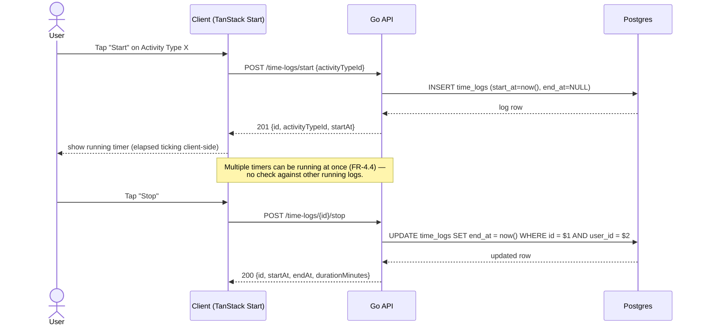
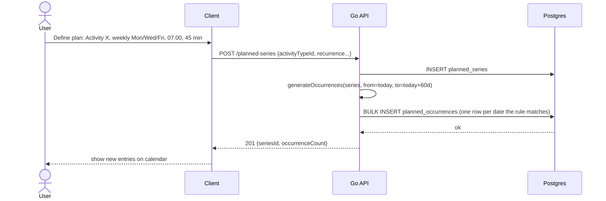
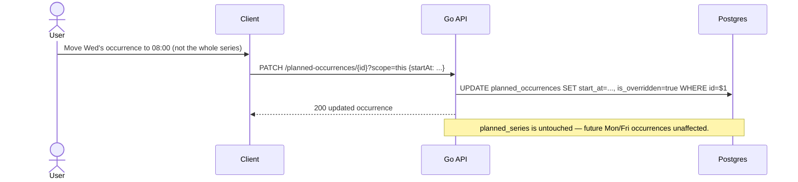
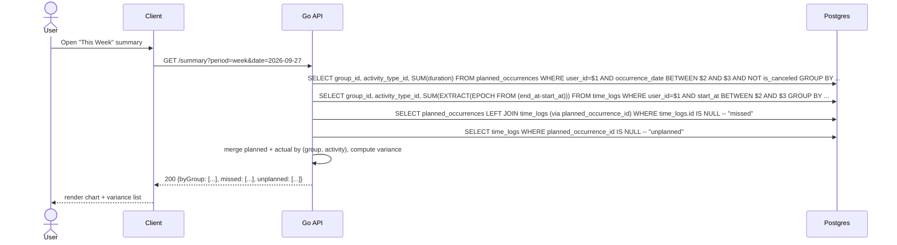
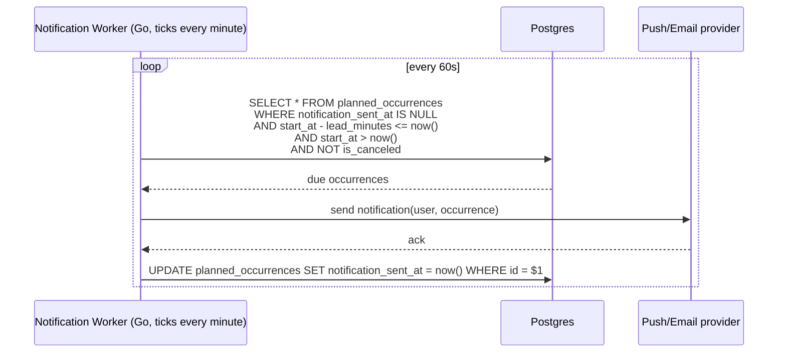
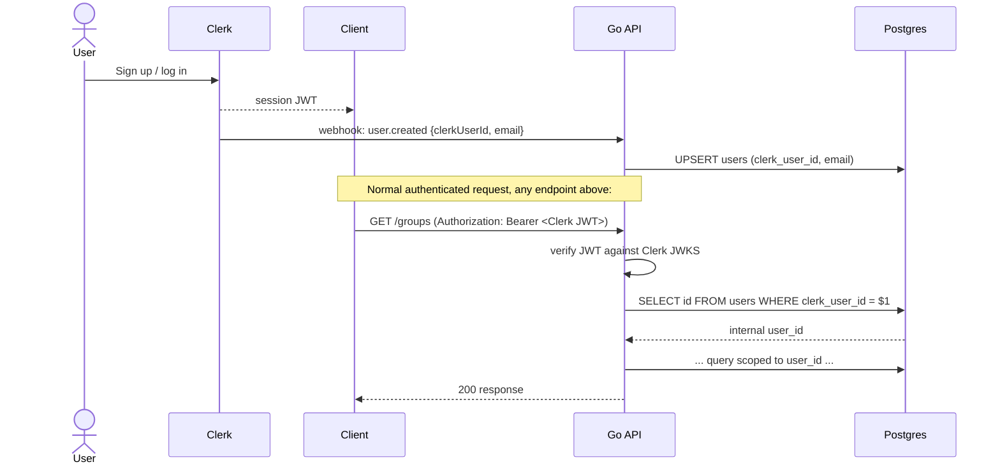

# Data Flows

Sequence diagrams for the flows that touch multiple components. Entities
referenced here are defined in [data-model.md](./data-model.md); endpoints
are defined in [api-design.md](./api-design.md).

## 1. Start / stop recording an activity

The most latency-sensitive flow (NFR-1: <200ms perceived) — it's a single
row write in both directions, no joins needed on the hot path.

Retroactive logging (FR-4.5) is the same write, just with client-supplied
`startAt`/`endAt` via `POST /time-logs` instead of the start/stop pair.

## 2. Create a recurring plan (and materialize occurrences)

A daily background job extends every active series' materialized window
forward (see [api-design.md §6.1](./api-design.md#61-recurrence-materialization-at-scale))
so the client never has to interpret recurrence rules itself.

### 2a. Editing one occurrence ("this occurrence only" — the default)

"This and following" / "all" scopes are handled per
[data-model.md §3](./data-model.md#3-recurrence-materialization) — they
touch `planned_series`, not just one row, and trigger re-materialization.

## 3. Planned-vs-actual summary (week/month view)

Both aggregate queries run independently (they hit different tables) and
are merged in the API layer rather than with one large SQL join — keeps
each query simple and independently indexable
(see [api-design.md §6.2](./api-design.md#62-summary-query-performance)).

## 4. Reminder notification before a planned entry

`notification_sent_at` makes delivery idempotent — a worker crash mid-batch
just means some rows retry the next tick, never double-sent (barring a
crash between send and stamp, which is an accepted at-least-once edge
case — see [api-design.md §6.4](./api-design.md#64-notification-delivery-reliability)).

## 5. User sync from Clerk

If a request arrives before the webhook has landed (race on first login),
the API upserts the `users` row itself from the verified JWT claims instead
of failing — the webhook is an optimization, not the only path.
